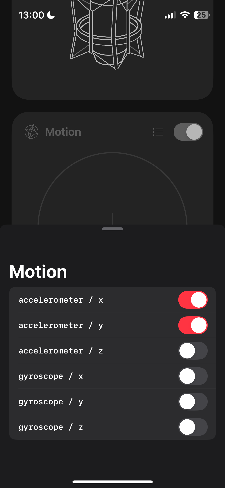

# SQUONG

SQUONG ist eine aufregende Abwandlung des klassischen Spiels Pong! In diesem kooperativen Multiplayer-Spiel (2-3 Spieler) ist Teamwork gefragt: Ziel ist es, den Ball mit euren Paddles so oft wie möglich abprallen zu lassen und gemeinsam den Highscore zu knacken. Es gibt keinen Konkurrenzkampf – nur einen gemeinsamen Punkte-Counter.

## 🕹️ Spielmodi

### Tastensteuerung (Fallback-Option)

- **2 Spieler:**
  - Linkes Paddle: `W`, `A`, `S`, `D`
  - Rechtes Paddle: Pfeiltasten
- **3 Spieler:**
  - Linkes Paddle: `W`, `A`, `S`, `D`
  - Rechtes Paddle: Pfeiltasten
  - Mittleres Paddle: `Z`, `G`, `H`, `J`

### Handy als Controller (Empfohlene Option)

Spieler steuern ihre Paddles durch das Neigen ihres Handys. **Aktuell nur mit iPhones kompatibel.**

---

## 📱 Einrichtung für Handy-Steuerung

### Voraussetzungen

1. Lade die App **[Data OSC](https://apps.apple.com)** für dein iPhone aus dem App Store herunter (kostenlos).
2. Finde die IP-Adresse deines Computers heraus:
   - Einstellungen > WLAN > Tippe auf dein verbundenes Netzwerk > IP-Adresse

### Konfiguration

1. Öffne die Data OSC-App und Aktiviere "OSC"

   - Gib die **IP-Adresse** deines Computers ein.
   - Setze den **Port** entsprechend:
     - Spieler 1: `5005`
     - Spieler 2: `6006`
     - Spieler 3: `7007`
   - Aktiviere "Motion", drücke auf das Menü bei Motion und stelle sicher, dass accelerometer/x und accelerometer/y aktiviert sind,

2. Starte das Python-Skript im Ordner `scripts/oscdetection`:

   ```bash
   python3 oscdetection.py
   ```

3. Befolge die Anweisungen im Terminal und gib deine IP-Adresse ein. Überprüfe, ob in der Ausgabe Werte für p1, p2 und p3 angezeigt werden. Falls ja, funktioniert die Verbindung.




### Spielstart

1. Starte das Godot-Spiel.
2. Steuere dein Paddle mit deinem Handy!

## 🚀 Installation

Lade dieses Repository herunter:

```
git clone git@github.com:sinamatic/Godot_Pong.git
```

- Stelle sicher, dass Python installiert ist (für die Handy-Controller-Integration):
- Installiere ggf. die benötigten Python-Pakete:

```
pip install python-osc
```

- Starte das Spiel über Godot

# ✨ Features

- Kooperatives Gameplay: Arbeitet zusammen und sammelt Punkte.
- Multiplayer: Für 2-3 Spieler.
- Einzigartiger Controller-Support: Nutze dein Handy als Paddle-Controller.
- Flexible Steuerung: Alternativsteuerung über Tasten.

# 💡 Feedback & Beiträge

Du hast Feedback, Bugs gefunden oder Ideen für Verbesserungen? Erstelle ein Issue oder reiche einen Pull Request ein. Wir freuen uns auf deine Beiträge!

# ToDos

- [ ] Ggf. Schwierigkeit mit der Zeit erhöhen: Paddle wird zB Schmaler nach 2 min oder nach 20 scores?
  - Geschwindigkeit vom Ball schneller
  - Ballgröße verändern
  - Paddle breiter oder schmaler machen
  - Paddlegeschwindigkeit ändern
- [ ] Münzen random einblenden, wenn Münze mit Paddle getroffen Score +1 und Paddle breiter?
- [ ] Score ggf. speichern und davon dann in Ballshop neue Bälle kaufen, zB Dicker oder Rechteckig mit anderer Physik o.Ä.
